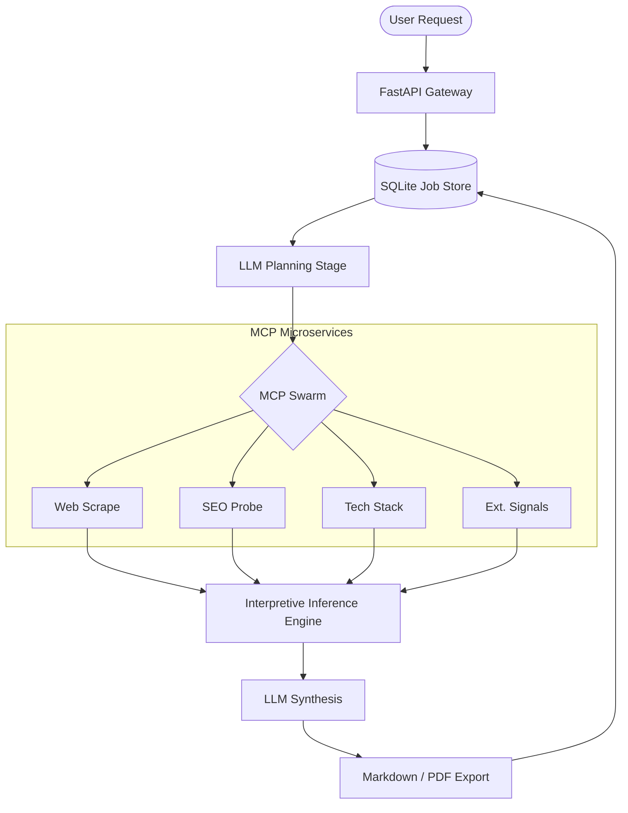

# **SPEC_D_001: Signal Analyst OSINT Intelligence System**

### **The Autonomous "Analyst-in-a-Box" for High-Stakes Target Research**

[](https://fastapi.tiangolo.com/)
[](https://ollama.com/)
[](#)
[](#security)

---

## **1. Overview — Why Signal Analyst?**

In a world drowning in public data, the bottleneck for investment analysts, sales teams, and corporate strategists is no longer *access* to information, but the **speed of triangulation**. 

**Signal Analyst** is an autonomous intelligence system designed to automate the cross-referencing of a company’s digital footprint. It replaces hours of manual research with a 60-second execution pipeline that deciphers a target's tech stack, hiring velocity, social sentiment, and SEO posture into a single, consultant-grade report.

---

## **2. The Intelligence Pipeline**

The system operates via a refined **Plan → Probe → Infer → Synthesize** architecture:

### **Phase A: The Planning Stage**
Unlike "dumb" scrapers, Signal Analyst begins with reasoning. The **LLM Planning Layer** inspects the target domain and the user’s research focus. It dynamically selects which specialized Model Context Protocol (MCP) microservices to activate—saving compute and avoiding detection.

### **Phase B: Parallel Surface Probing**
The engine orchestrates a swarm of independent MCP services:
*   **Web Scrape**: Extracts semantic metadata using browser-mimicking headers and rotating UAs.
*   **SEO Probe**: Analyzes search visibility and structural hygiene.
*   **Tech Stack**: Fingerprints frameworks and infrastructure by analyzing **raw HTML** (requires successful scrape to function; may be limited on bot-protected sites).
*   **Reviews / Social / Hiring / Ads**: Signal collectors that feed the inference engine.

### **Phase C: Interpretive Inference (Core Intelligence)**
The hallmark of Signal Analyst is the **Interpretive Inference Layer**. Instead of emitting "no data" errors when a scraper is blocked or a service is absent, the system converts **absence into signal**. 
*   *Example*: No social footprint → "Quiet Professional" posture (relationship-driven sales).
*   *Example*: Opaque tech stack → Correlates with legacy enterprise or air-gapped security.

### **Phase D: Expert Synthesis**
The **Inferred Profile** is passed to the LLM (Gemini or Ollama) to produce the final brief. This stage always includes a mandatory **Strategic Posture Summary**—a high-density synthesis of what the company optimizes for and where it is vulnerable.

---

## **3. Quick Start**

```bash
cd micro_analyst_full_with_scripts

# 1. Configure the environment
cp .env.example .env
# Edit .env: set USE_OLLAMA_LLM=1 for local development or GOOGLE_API_KEY for cloud.

# 2. Install dependencies
pip install -r requirements.txt

# 3. Start MCP microservices
./run_all.sh

# 4. Launch the Backend (REQUIRED)
./run_all.sh
# Wait for: "Backend ready at http://localhost:8000"
# Verify: curl http://localhost:8000/health

# 5. Launch the Frontend (optional, for UI)
cd miniapp
python3 -m http.server 8080
# Visit http://localhost:8080

# ⚠️ The frontend will NOT work unless the backend is running on port 8000.
```

---

## **4. Commercial Features & Security**

Signal Analyst is hardened for production deployment, moving beyond "toy" status with several critical safeguards:

### **Multi-Tenancy & Persistence**
*   **Report Persistence**: Completed analysis reports are stored in SQLite and survive restarts.
*   **Job State Recovery**: In-flight jobs interrupted by a crash are detected on startup and marked as "failed" to prevent infinite queues.
*   **Quota Enforcement**: Built-in daily reporting limits per API key (`DAILY_QUOTA_PER_KEY`).
*   **Sliding Window Rate Limiting**: Prevents API abuse and infrastructure cost-runaway.

### **Interpretive Inference Layer**
*   **Absence-as-Signal**: No section is ever left empty. Missing data is mapped to plausible strategic causes (e.g., "Enterprise SLG motion").
*   **Strategic Posture Mandatory**: Every report is capped with a synthesized summary of the target's operational optimize-for.
*   **Epistemic Honesty**: Uses probabilistic language ("suggests," "likely") to ensure inferences aren't mistaken for hard-scraped facts.

### **Security & Robustness**
*   **Default Authentication**: API Key authentication enabled by default (`ENABLE_AUTH=1`).
*   **WAF Bypass**: Scraper uses browser-mimicking headers (`Referer`, `Accept-Language`) and extended timeouts (300s) to handle aggressive WAFs and high-latency synthesis.
*   **Network Isolation**: MCP microservices bind to `127.0.0.1` to prevent external access.
*   **SSRF Protection**: Strict validation logic blocks attacks at the `/analyze` gateway.
*   **Input Sanitization**: Pydantic-enforced limits on all metadata.

---

## **5. API Interface**

### **Initiate Research**
```bash
curl -X POST http://localhost:8000/analyze \
  -H "Content-Type: application/json" \
  -H "X-API-Key: demo_key_abc123" \
  -d '{"company_url": "https://glossier.com", "focus": "competitor tech stack analysis"}'
```

### **Poll Status & Quota**
```bash
curl http://localhost:8000/jobs/{job_id} -H "X-API-Key: demo_key_abc123"

# Response includes 'quota_remaining' to help clients manage usage.
```

---

## **6. Report Modes**

Signal Analyst can adopt different "Persona Filters" during synthesis:

| Mode | Trigger | Output Style |
|------|-------------|-------|
| **Standard** | (default) | Balanced, neutral, consultant-grade brief. |
| **Red Team** | `"red team"` | Adversarial; focuses exclusively on vulnerabilities and failure modes. |
| **Narrative** | `"narrative"` | Long-form prose suitable for senior executive memos. |
| **Investor** | `"investor"` | Metrics-driven; looks for scalability and efficiency signals. |
| **Founder** | `"founder"` | Tactical; uses the "YC partner playbook" style for growth advice. |

---

## **7. Architecture Diagram**



---

## **9. Verification & Testing**

To ensure the interpretive inference layer remains robust and honest, run the automated test suite:

```bash
# From micro_analyst_full_with_scripts/
python3 -m unittest tests/test_inference.py
```

This suite validates:
1.  **Empty Input Resilience**: Ensures reports still generate correctly when all scrapers fail.
2.  **Strategic Soundness**: Verifies that missing signals (e.g., no reviews) are correctly mapped to plausible strategic interpretations.
3.  **Epistemic Honesty**: Confirms the system uses probabilistic qualifiers and avoids hallucinating concrete metrics.

---

## **10. Deployment Notes**

*   **PDF Export**: Requires system-level dependencies for `WeasyPrint` (`brew install pango cairo`). If missing, the system gracefully disables PDF export while maintaining all other functionality.
*   **Proxy Rotation**: For high-volume professional use, we recommend wrapping the `web_scrape` service in a proxy rotation layer (e.g., BrightData or ScraperAPI) to bypass advanced bot detection.

---

## **License & Proprietary Notice**

- **Demo Mode**: The frontend includes a comprehensive `demo_data.js` simulator that mimics the API response for selected targets (Blue Bottle, Sweetgreen, Glossier) without needing the backend to be active.
 
© 2026 SPEC_D. Internal Prototype - Not for Public Distribution.
