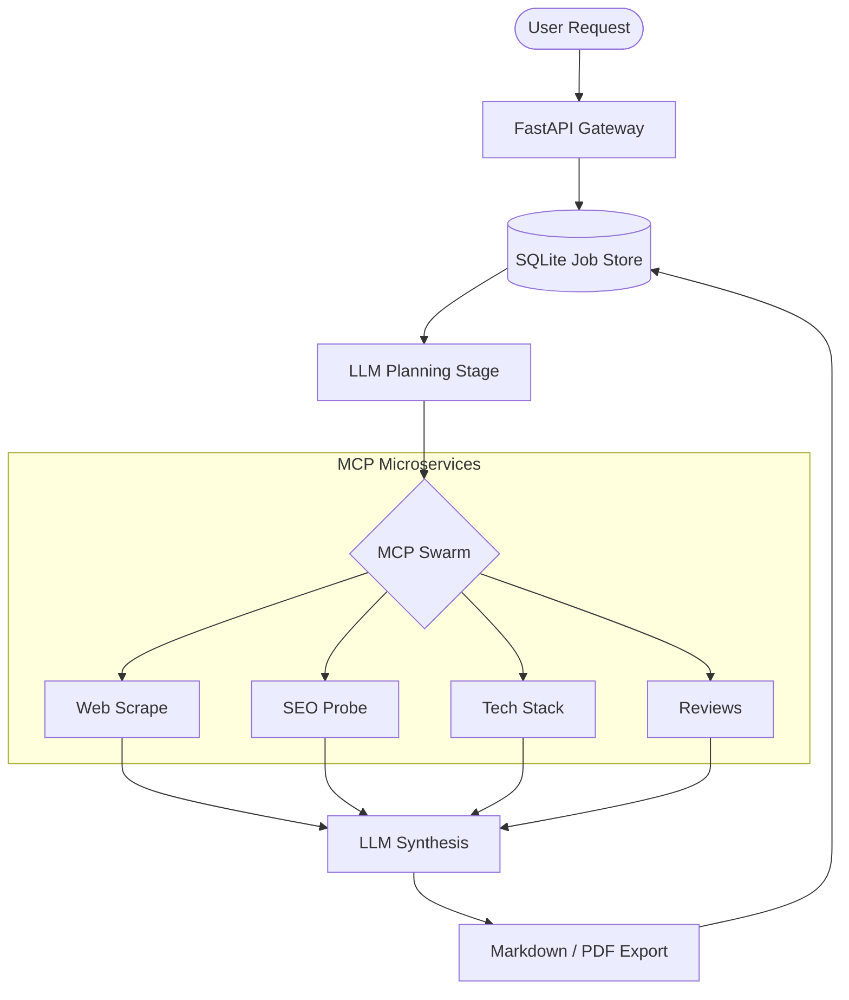

# **SPEC_D_001: Signal Analyst OSINT Intelligence System**

### **The Autonomous "Analyst-in-a-Box" for High-Stakes Target Research**

[](https://fastapi.tiangolo.com/)
[](https://ollama.com/)
[](#)
[](#security)

---

## **1. Overview — Why Signal Analyst?**

In a world drowning in public data, the bottleneck for investment analysts, sales teams, and corporate strategists is no longer *access* to information, but the **speed of triangulation**. 

**Signal Analyst** is an autonomous intelligence system designed to automate the cross-referencing of a company’s digital footprint. It replaces hours of manual research with a 60-second execution pipeline that deciphers a target's tech stack, hiring velocity, social sentiment, and SEO posture into a single, consultant-grade report.

---

## **2. The Intelligence Pipeline**

The system operates via a refined **Plan → Probe → Synthesize** architecture:

### **Phase A: The Planning Stage**
Unlike "dumb" scrapers, Signal Analyst begins with reasoning. The **LLM Planning Layer** inspects the target domain and the user’s specific research focus. It dynamically selects which specialized Model Context Protocol (MCP) microservices to activate—saving compute and avoiding detection by prioritizing relevant data surfaces.

### **Phase B: Parallel Surface Probing**
The engine orchestrates a swarm of independent MCP services:
*   **Web Scrape**: Extracts semantic metadata and core messaging.
*   **SEO Probe**: Analyzes search visibility and organic reach.
*   **Tech Stack**: Fingerprints frameworks, libraries, and backend infrastructure.
*   **Reviews & Social**: `[STUB]` Architecture ready for external API integration.
*   **Careers & Ads**: `[STUB]` Architecture ready for hiring signal integration.

### **Phase C: Expert Synthesis**
Once the data is returned, an LLM (either a high-concurrency cloud model like Gemini or a privacy-first local instance like Gemma 3 via Ollama) sits as the "Analyst." It merges the raw JSON telemetry into a structured intelligence report, emphasizing tensions, opportunities, and risks.

---

## **3. Quick Start**

```bash
cd micro_analyst_full_with_scripts

# 1. Configure the environment
cp .env.example .env
# Edit .env: set USE_OLLAMA_LLM=1 for local development or GOOGLE_API_KEY for cloud.

# 2. Install dependencies
pip install -r requirements.txt

# 3. Start MCP microservices
./run_all.sh

# 4. Launch the primary Agent
uvicorn agent.micro_analyst:app --port 8000
```

---

## **4. Commercial Features & Security**

Signal Analyst is hardened for production deployment, moving beyond "toy" status with several critical safeguards:

### **Multi-Tenancy & Persistence**
*   **Report Persistence**: Completed analysis reports are stored in SQLite and survive restarts.
*   **Job State Recovery**: In-flight jobs interrupted by a crash are detected on startup and marked as "failed" to prevent infinite queues.
*   **Quota Enforcement**: Built-in daily reporting limits per API key (`DAILY_QUOTA_PER_KEY`).
*   **Sliding Window Rate Limiting**: Prevents API abuse and infrastructure cost-runaway.

### **Security Hardening**
*   **Default Authentication**: API Key authentication enabled by default (`ENABLE_AUTH=1`).
*   **Network Isolation**: MCP microservices bind to `127.0.0.1` to prevent external access.
*   **SSRF Protection**: Strict validation logic blocks attacks at the `/analyze` gateway targeting `localhost` or cloud metadata.
*   **Ownership Validation**: Users can only access reports belonging to their API key.
*   **Input Sanitization**: Pydantic-enforced length limits on all metadata to prevent buffer overruns or memory-based attacks.

---

## **5. API Interface**

### **Initiate Research**
```bash
curl -X POST http://localhost:8000/analyze \
  -H "Content-Type: application/json" \
  -H "X-API-Key: demo_key_abc123" \
  -d '{"company_url": "https://glossier.com", "focus": "competitor tech stack analysis"}'
```

### **Poll Status & Quota**
```bash
curl http://localhost:8000/jobs/{job_id} -H "X-API-Key: demo_key_abc123"

# Response includes 'quota_remaining' to help clients manage usage.
```

---

## **6. Report Modes**

Signal Analyst can adopt different "Persona Filters" during synthesis:

| Mode | Trigger | Output Style |
|------|-------------|-------|
| **Standard** | (default) | Balanced, neutral, consultant-grade brief. |
| **Red Team** | `"red team"` | Adversarial; focuses exclusively on vulnerabilities and failure modes. |
| **Narrative** | `"narrative"` | Long-form prose suitable for senior executive memos. |
| **Investor** | `"investor"` | Metrics-driven; looks for scalability and efficiency signals. |
| **Founder** | `"founder"` | Tactical; uses the "YC partner playbook" style for growth advice. |

---

## **7. Architecture Diagram**



---

## **8. Deployment Notes**

*   **PDF Export**: Requires system-level dependencies for `WeasyPrint` (`brew install pango cairo`). If missing, the system gracefully disables PDF export while maintaining all other functionality.
*   **Proxy Rotation**: For high-volume professional use, we recommend wrapping the `web_scrape` service in a proxy rotation layer (e.g., BrightData or ScraperAPI) to bypass advanced bot detection.

---

## **License & Proprietary Notice**

- **Demo Mode**: The frontend includes a comprehensive `demo_data.js` simulator that mimics the API response for selected targets (Blue Bottle, Sweetgreen, Glossier) without needing the backend to be active.
 
© 2026 SPEC_D. Internal Prototype - Not for Public Distribution.
