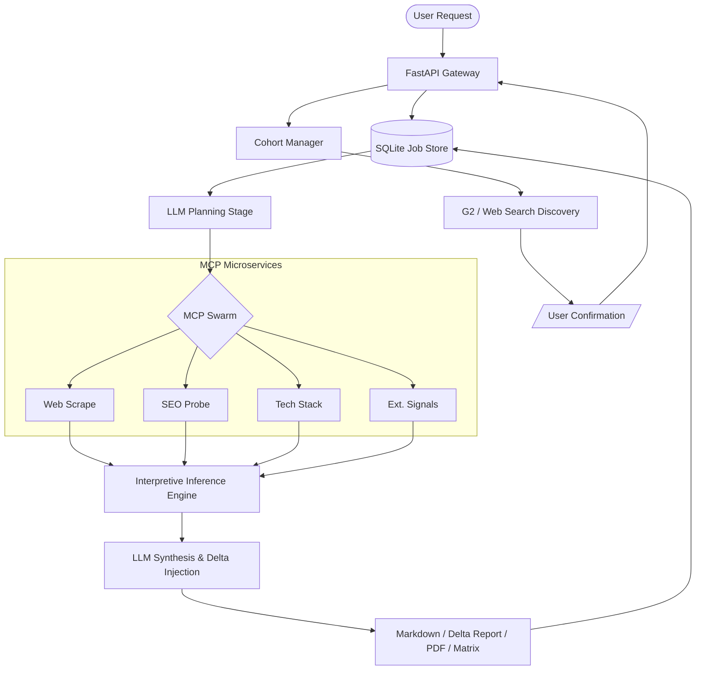

# **SPEC_D_001: Signal Analyst OSINT Intelligence System**

### **The Autonomous "Analyst-in-a-Box" for High-Stakes Target Research**

[](https://fastapi.tiangolo.com/)
[](https://ollama.com/)
[](#)
[](#security)
[](#persistence--strategic-change-detection)
[](#saas-cohort-mode-v1)

---

## **1. Overview — Why Signal Analyst?**

In a world drowning in public data, the bottleneck for investment analysts, sales teams, and corporate strategists is no longer *access* to information, but the **speed of triangulation**. 

**Signal Analyst** is an autonomous intelligence system designed to automate the cross-referencing of a company’s digital footprint. It replaces hours of manual research with a 60-second execution pipeline that deciphers a target's tech stack, hiring velocity, social sentiment, and SEO posture into a single, consultant-grade report with **automated strategic change tracking**.

---

## **2. The Intelligence Pipeline**

The system operates via a refined **Plan → Probe → Infer → Synthesize** architecture:

### **Phase A: The Planning Stage**
Unlike "dumb" scrapers, Signal Analyst begins with reasoning. The **LLM Planning Layer** inspects the target domain and the user’s research focus. It dynamically selects which specialized Model Context Protocol (MCP) microservices to activate—saving compute and avoiding detection.

### **Phase B: Parallel Surface Probing**
The engine orchestrates a swarm of independent MCP services:
*   **Web Scrape**: Extracts semantic metadata using browser-mimicking headers and rotating UAs.
*   **SEO Probe**: Analyzes search visibility and structural hygiene.
*   **Tech Stack**: Fingerprints frameworks and infrastructure by analyzing **raw HTML** (requires successful scrape to function; may be limited on bot-protected sites).
*   **Reviews / Social / Hiring / Ads**: Signal collectors that feed the inference engine.

### **Phase C: Interpretive Inference (Core Intelligence)**
The hallmark of Signal Analyst is the **Interpretive Inference Layer**. Instead of emitting "no data" errors when a scraper is blocked or a service is absent, the system converts **absence into signal**. 
*   *Example*: No social footprint → "Quiet Professional" posture (relationship-driven sales).
*   *Example*: Opaque tech stack → Correlates with legacy enterprise or air-gapped security.

### **Phase D: Expert Synthesis & Delta Overlay**
The **Inferred Profile** is passed to the LLM (Gemini or Ollama) to produce the final brief. This stage includes:
*   **Strategic Recommendations**: A mandatory high-density synthesis of optimization targets and vulnerabilities.
*   **Time-Delta Injection**: Automated comparison against the last successful snapshot, surfacing shifts in technology, hiring velocity, and market visibility.

---

## **3. Quick Start (One Command)**

For rapid local development, use the combined dev runner:

```bash
chmod +x run_dev.sh
./run_dev.sh
```

*   **Frontend**: [http://localhost:8080](http://localhost:8080)
*   **Backend**: [http://localhost:8000](http://localhost:8000)

---

## **4. Detailed Setup**

```bash
cd micro_analyst_full_with_scripts

# 1. Configure the environment
cp .env.example .env
# Edit .env: set USE_OLLAMA_LLM=1 for local development or GOOGLE_API_KEY for cloud.

# 2. Install dependencies
pip install -r requirements.txt

# 3. Start MCP microservices (requires tmux)
./run_all_tmux.sh

# 4. Launch the Backend with uvicorn (REQUIRED)
uvicorn agent.micro_analyst:app --host 0.0.0.0 --port 8000
# Wait for: "Backend ready at http://localhost:8000"
# Verify: curl http://localhost:8000/health

# 5. Launch the Frontend (optional, for UI)
cd miniapp
python3 -m http.server 8080
# Visit http://localhost:8080

# ⚠️ The frontend will NOT work unless the backend is running on port 8000.
```

---

## **5. Persistence & Strategic Change Detection**

Signal Analyst is hardened for production deployment, moving beyond "toy" status with several critical safeguards:

### **Time-Delta & Dynamic Persistence**
*   **Time-Delta v1**: The system now stores snapshots of every analysis. On repeat runs, it executes a deterministic diff to identify "breakage" (went dark), "emergence" (new signals), and calculates a 0.0-1.0 stability score.
*   **Report History**: Completed analysis reports are stored in SQLite; previous runs serve as strategic baselines for drift detection.
*   **Job State Recovery**: In-flight jobs interrupted by a crash are detected on startup and marked as "failed" to prevent infinite queues.

### **Interpretive Inference Layer**
*   **Absence-as-Signal**: No section is ever left empty. Missing data is mapped to plausible strategic causes (e.g., "Enterprise SLG motion").
*   **Strategic Recommendations**: Every report is capped with a synthesized summary of the target's operational posture and optimization paths.
*   **Epistemic Honesty**: Uses probabilistic language ("suggests," "likely") to ensure inferences aren't mistaken for hard-scraped facts.

### **Security & Quota Control**
*   **Auth-First Enforcement**: API Key verification (`401`) occurs *before* rate limiting or quota checks, ensuring resources are only consumed by authorized users. 
*   **Built-in Quotas**: Daily reporting limits (`DAILY_QUOTA_PER_KEY`) and sliding window rate limiting prevent resource abuse.
*   **WAF Bypass**: Scraper uses browser-mimicking headers and extended timeouts (300s) to handle aggressive anti-bot defenses.
*   **Safety & Isolation**: Strict SSRF protection at the `/analyze` gateway and network isolation for all internal MCP microservices.

---

## **6. SaaS Cohort Mode (v1)**

Signal Analyst now supports **Cohort Analysis**, allowing you to move from individual target research to peer-group benchmarking. This mode uses a **Propose → Confirm → Execute** workflow to ensure discovery is both autonomous and auditable.

### **How it Works**
1.  **Anchor Discovery**: Input one company URL; the system extracts category terms and probes **G2** and **Web Search** for competitors.
2.  **Explicit Confirmation**: The user reviews the proposed peer list and confirms which targets to analyze.
3.  **Cross-Target Execution**: The system fans out existing single-URL probes to every target in the cohort.
4.  **Signal Normalization (CMATRIX_001)**: Results are compressed into a boolean/categorical comparison matrix.

### **Normalized signal matrix includes:**
- **Tech Confidence**: High/Medium/Low/None fingerprinting strength.
- **Pricing/Docs Visibility**: Detected via shallow semantic scraping.
- **Hiring/Ads/Social Activity**: Transformed into binary presence signals.
- **SEO Hygiene**: Good/Fair/Poor rating based on structural metadata.

---

## **6. API Interface**

### **Single-URL Analysis**
```bash
curl -X POST http://localhost:8000/analyze \
  -H "Content-Type: application/json" \
  -H "X-API-Key: demo_key_abc123" \
  -d '{"company_url": "https://glossier.com", "focus": "competitor tech stack analysis"}'
```

### **SaaS Cohort Analysis**
Cohort mode follows a 4-step sequence:

**1. Propose Cohort**
```bash
curl -X POST http://localhost:8000/cohorts/propose \
  -H "X-API-Key: demo_key_abc123" \
  -d '{"anchor_url": "https://linear.app", "category_hint": "project management"}'
```

**2. Confirm Targets**
```bash
curl -X POST http://localhost:8000/cohorts/{cohort_id}/confirm \
  -H "X-API-Key: demo_key_abc123" \
  -d '{"final_urls": ["url1", "url2"], "include_anchor": true}'
```

**3. Execute Fan-Out**
```bash
curl -X POST http://localhost:8000/cohorts/{cohort_id}/analyze \
  -H "X-API-Key: demo_key_abc123"
```

**4. Retrieve Matrix & Report**
```bash
curl http://localhost:8000/cohorts/{cohort_id}/results -H "X-API-Key: demo_key_abc123"
```

---

## **8. Report Modes**

Signal Analyst can adopt different "Persona Filters" during synthesis:

| Mode | Trigger | Output Style |
|------|-------------|-------|
| **Standard** | (default) | Balanced, neutral, consultant-grade brief. |
| **Red Team** | `"red team"` | Adversarial; focuses exclusively on vulnerabilities and failure modes. |
| **Narrative** | `"narrative"` | Long-form prose suitable for senior executive memos. |
| **Investor** | `"investor"` | Metrics-driven; looks for scalability and efficiency signals. |
| **Founder** | `"founder"` | Tactical; uses the "YC partner playbook" style for growth advice. |

---

## **9. Architecture Diagram**



---

## **10. Verification & Testing**

To ensure the interpretive inference layer remains robust and honest, run the automated test suite:

```bash
# From micro_analyst_full_with_scripts/
python3 -m unittest tests/test_inference.py
```

This suite validates:
1.  **Empty Input Resilience**: Ensures reports still generate correctly when all scrapers fail.
2.  **Strategic Soundness**: Verifies that missing signals are correctly mapped to plausible strategic interpretations.
3.  **Epistemic Honesty**: Confirms the system uses probabilistic qualifiers and avoids hallucination.
4.  **Strategic Change Detection**: Validates that snapshots are correctly compared and shifts are surfaced with accurate significance (`tests/test_snapshot_delta.py`).

---

## **11. Deployment Notes**

*   **PDF Export**: Requires system-level dependencies for `WeasyPrint` (`brew install pango cairo`). If missing, the system gracefully disables PDF export while maintaining all other functionality.
*   **Proxy Rotation**: For high-volume professional use, we recommend wrapping the `web_scrape` service in a proxy rotation layer (e.g., BrightData or ScraperAPI) to bypass advanced bot detection.

---

## **License & Proprietary Notice**

- **Demo Mode**: The frontend includes a comprehensive `demo_data.js` simulator that mimics the API response for selected targets (Blue Bottle, Sweetgreen, Glossier) without needing the backend to be active.
 
**Project Status**: Time-Delta v1 Live | Cohort Mode v1 Live
© 2026 SPEC_D. Internal Prototype - Not for Public Distribution.
